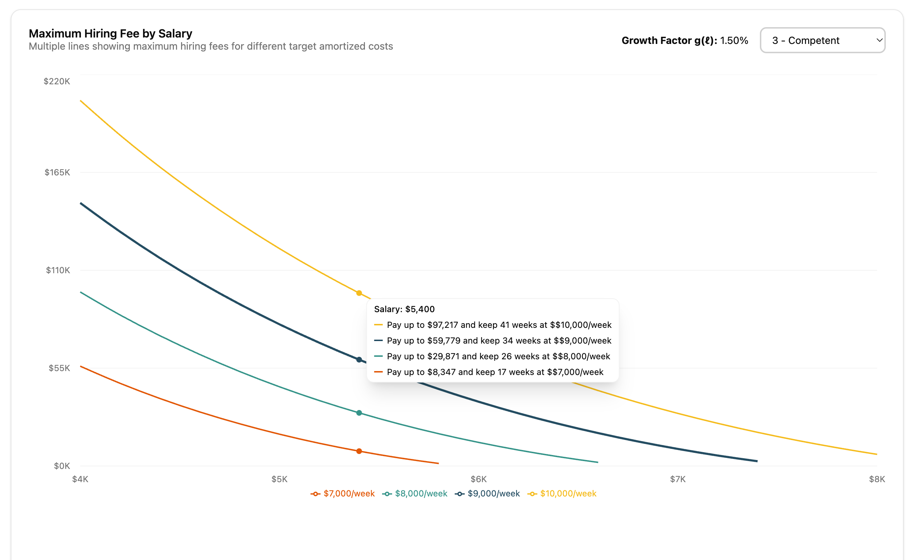
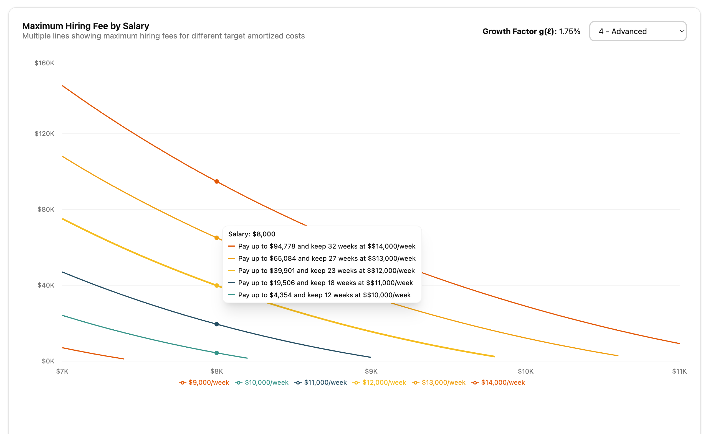

# 🔍 Amortized Cost Analyzer

Interactive web app for analyzing amortized costs of BuzzerBeater staff.

## Setup

```bash
cd amortized-cost-viz
npm install
npm run dev
```

## Features

- **Time Analysis**: View amortized cost over time with optimal duration visualization
- **Salary Comparison**: Compare optimal cost vs salary with dual-axis charts
- **Max Hiring Fee**: Calculate maximum hiring fees for different target costs

## Use Cases

- **Find optimal retention duration**: Determine the optimal number of weeks to keep your current staff member for maximum cost efficiency
- **Budget hiring costs**: Choose the amortized cost you're comfortable with and find the maximum hiring fee you should allocate (see screenshots below for examples)
- **Market analysis**: Given hiring cost data, find the minimal amortized weekly cost at optimal retention duration across different starting salaries

## Screenshots

### Max Hiring Fee Calculator - Level 3 (Competent)



### Max Hiring Fee Calculator - Level 4 (Advanced)



## Formula

The amortized cost $A(S,T,L)$ is calculated using the following formula:

$$A(S,T,L) = \frac{h(S,L)}{T} + \frac{S}{T} \cdot \frac{(1+g(L))^{T+1}-1}{g(L)}$$

Where:

- $S$ = Starting salary
- $T$ = Duration (weeks)
- $L$ = Asset level (1-7)
- $g(L)$ = Growth factor: $(L-1) \times 0.25\%$
- $h(S,L)$ = Hiring cost (linear interpolation from market data)

## Tech Stack

- React + TypeScript
- Vite
- TanStack Start
- Recharts
- Tailwind CSS + shadcn/ui
